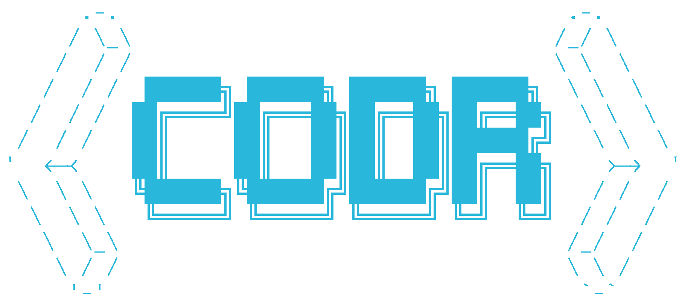

---

# Codr CLI — AI Developer Assistant

Codr is a terminal-native AI tool built for developers. It helps you write, refactor, and understand code, analyze documents, work with your codebase, and build full-stack projects — all from the command line.

Everything runs through a single AI agent, with modular tools that handle code, documents, webpages, and more.

---

## Features

- Answer code questions, debug, and refactor
- Summarize and chat with PDFs, DOCX, and markdown files
- Analyze webpages or local HTML
- Ask questions about your JS, TS, or Python codebase
- Generate full-stack projects from a single prompt
- Initialize Codr into an existing project for context-aware help

---

## Installation

Clone the repo and install dependencies from the root:

```bash
git clone https://github.com/pshycodr/codr
cd codr
bun install         # for CLI (apps/cli-ts)
uv venv .venv       # for Python RAG (apps/rag-py)
uv pip install -r requirements.txt
````

Run Codr:

```bash
bun codr
```

---

## Usage

```bash
codr <prompt...>               Chat with Codr for small quick tasks
codr create <goal>            Create a full-stack project (backend → frontend)
codr init                     Initialize Codr in an existing project
codr doc -p <path> -q <query> Query local documents (PDF, DOCX, MD)
codr webpage -p <path> -q <query> Analyze a local webpage or HTML file
codr codebase -p <path> -q <query> Ask questions about your codebase
```

### Common Flags

* `-p <path>`: Path to a file or folder
* `-q <query>`: Your question or prompt
* `--chat`: Enables persistent chat mode
* `-h, --help`: Show help
* `-V, --version`: Show version

---

## Examples

```bash
codr "What does this TypeScript error mean?"
codr create "Build a blogging platform with MongoDB and dark mode UI"
codr init 
codr doc -p resume.pdf -q "Summarize my experience"
codr webpage -p "https://example.com/" -q "Extract key stats from this page"
codr codebase -p ./my-app -q "How is user authentication handled?"
```

---

## Project Structure

```
/apps
  /cli-ts       → TypeScript CLI interface
  /codebase     → Parsing Codebases (ts/js and py)
  /rag-py       → Python RAG server (docs, codebase, web)
package.json    → Bun project setup
requirements.txt → Python dependencies
public/         → Assets (e.g., logo)
```

---

## Notes

* Codr uses a single AI agent with specialized tools for different tasks.
* All dependencies are centralized at the project root.

---


## License
Codr is licensed under the [Apache](LICENSE), Version 2.0.

You are free to use, modify, and distribute it, but you must include proper credit and retain the original license and NOTICE file in any redistributed version.

See [LICENSE](LICENSE) for full details.